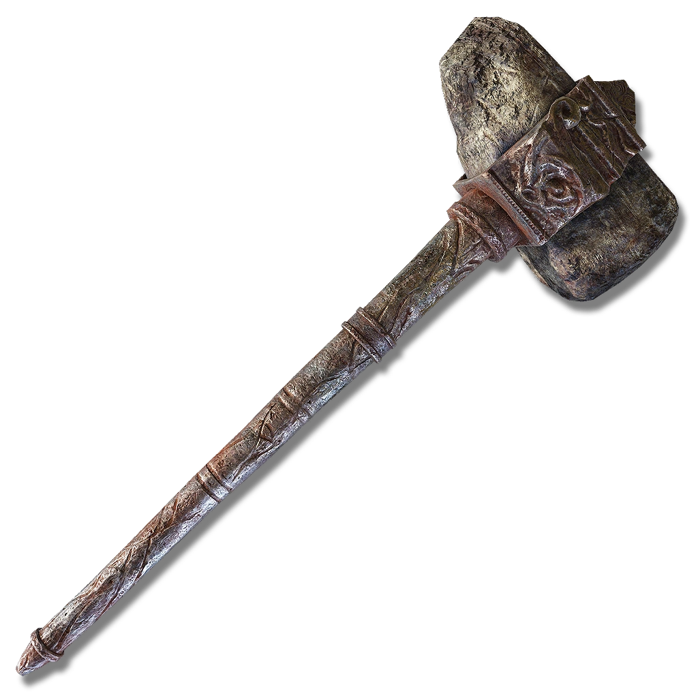

# hewg

> *"You're a new face. No matter. Lay out your arms. Let's get smithing."*



A collection of tools I've made to help with general development.

## Tile Editor
#### Status: stable but improvable

On running, creates a window with a palette and a canvas. Individual tiles can be selected from the palette, drawn onto the canvas, and exported as a JSON file, such as the following beautiful smiley face:
```json
{
    "(2, 4)": 4,
    "(3, 5)": 4,
    "(4, 1)": 4,
    "(4, 2)": 4,
    "(4, 3)": 4,
    "(4, 5)": 4,
    "(5, 5)": 4,
    "(6, 1)": 4,
    "(6, 2)": 4,
    "(6, 3)": 4,
    "(6, 5)": 4,
    "(7, 5)": 4,
    "(8, 4)": 4
}
```
The integer value corresponds to the tile's (zero-indexed) index in the palette. In this case, the middle of the 9 tiles in the default was used.

TODO: 
- Allow users to load in an existing JSON file and edit the map it defines
- Allow users to create custom brushes
- Allow users to load in their own palettes (currently loads in the default used for testing which is easily changeable)
- Support infinite grid
- Integrate with textbox to create a better startup UI


## Text Boxes
#### Status: refactoring


